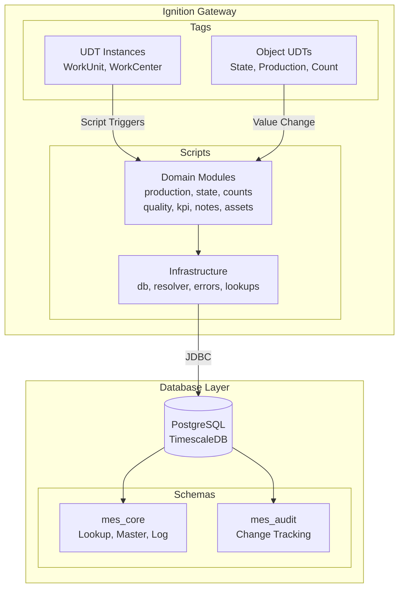
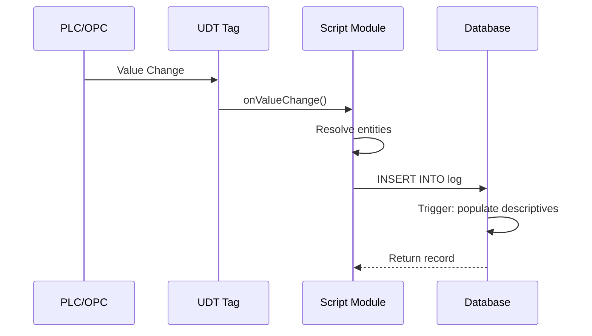
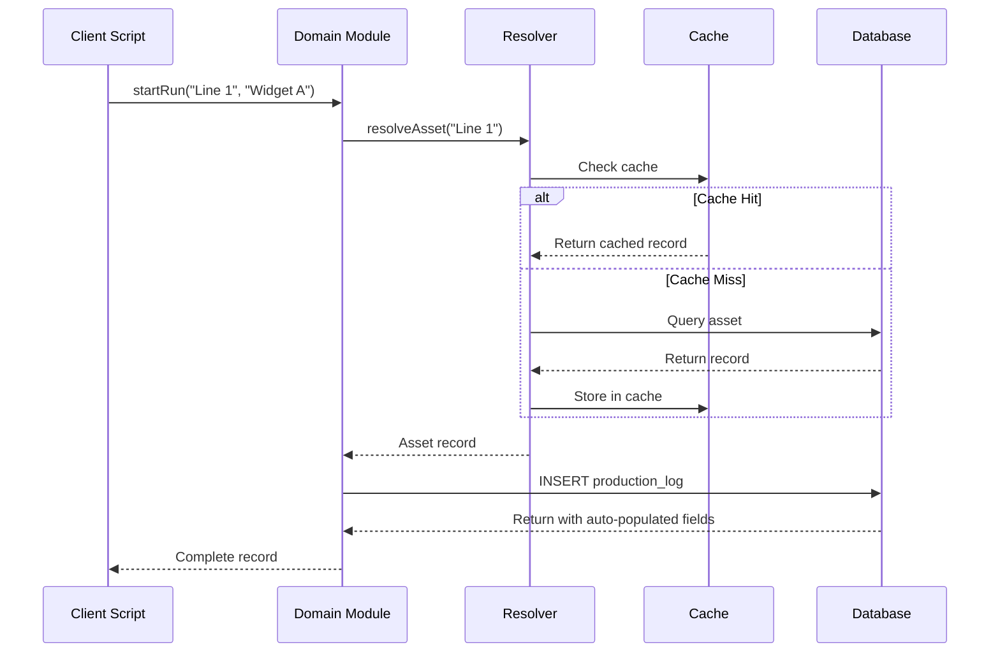

# MES System Architecture

This document describes the overall architecture of the MES system, including component relationships, data flow patterns, and technology stack.

## Architecture Diagram



## Component Overview

### 1. Tag Layer (UDTs)

User Defined Types (UDTs) represent the physical and logical structure of the manufacturing environment:

| UDT Category | Examples | Purpose |
|--------------|----------|---------|
| **Equipment** | WorkUnit, WorkCenter | Equipment hierarchy containers |
| **Object** | State, Production, Count, Measurement | Data objects with script triggers |
| **Process** | Filler, Labeler, Palletizer, etc. | Process-specific equipment templates |

UDTs automatically invoke scripts when values change, creating a reactive data flow from equipment to database.

### 2. Script Layer

The scripting library follows a layered architecture:

```
┌─────────────────────────────────────────────────────────┐
│                  Domain Modules                          │
│  production  state  counts  quality  kpi  notes  assets │
├─────────────────────────────────────────────────────────┤
│               Infrastructure Modules                     │
│         db        resolver        lookups               │
├─────────────────────────────────────────────────────────┤
│                   Error Handling                         │
│                      errors                              │
└─────────────────────────────────────────────────────────┘
```

#### Infrastructure Layer

| Module | Responsibility |
|--------|----------------|
| `db` | JDBC connection management, query execution, transactions |
| `resolver` | Entity resolution (asset, product, state) with caching |
| `lookups` | Cached reference data access |
| `errors` | Exception hierarchy for error handling |

#### Domain Layer

| Module | Responsibility |
|--------|----------------|
| `production` | Production run lifecycle (start, end, metrics) |
| `state` | Equipment state transitions and downtime tracking |
| `counts` | Production counting (good, scrap, infeed/outfeed) |
| `quality` | Measurement recording and tolerance checking |
| `kpi` | KPI recording and trending (OEE, availability, etc.) |
| `notes` | Annotations attached to log entries |
| `assets` | Asset hierarchy navigation and lookup |

### 3. Database Layer

The database uses three schemas for separation of concerns:

```
┌──────────────────────────────────────────────────────────┐
│                      mes_core                             │
├──────────────────────────────────────────────────────────┤
│  Lookup Tables    │  Master Tables   │  Log Tables       │
│  ----------------  ----------------   -----------------  │
│  asset_type       │ asset_definition │ state_log         │
│  state_type       │ product_family   │ production_log    │
│  state_definition │ product_def      │ count_log         │
│  count_type       │ perf_target      │ measurement_log   │
│  kpi_definition   │                  │ kpi_log           │
│  measurement_type │                  │ *_note tables     │
│  downtime_reason  │                  │                   │
└──────────────────────────────────────────────────────────┘

┌──────────────────────────────────────────────────────────┐
│                      mes_audit                            │
├──────────────────────────────────────────────────────────┤
│  change_log - Audit trail for all table modifications    │
└──────────────────────────────────────────────────────────┘
```

## Data Flow Patterns

### Pattern 1: UDT-Triggered Logging

When a UDT value changes, scripts automatically log the event:



### Pattern 2: API-Driven Operations

Direct script calls for complex operations:



### Pattern 3: Transactional Operations

Multiple operations in a single transaction:

```python
from mes.db import Transaction
from mes import production, state

with Transaction() as tx:
    # Both operations commit or rollback together
    run = production.startRun("Line 1", "Widget A", transaction=tx)
    state.changeState("Line 1", "Running", transaction=tx)
# Auto-commit on successful exit
```

## Database Trigger Architecture

Database triggers ensure data consistency:

### Auto-Population Triggers

Each log table has a trigger that populates descriptive fields:

```sql
-- Example: state_log trigger
INSERT INTO state_log (asset_id, state_id, ...)
-- Trigger automatically populates:
--   asset_name (from asset_definition)
--   state_name (from state_definition)
--   state_type_name (from state_type)
--   downtime_reason_name (if applicable)
```

This pattern:
- Reduces network traffic (fewer fields to send)
- Ensures consistency (names match at insert time)
- Supports historical accuracy (names captured at event time)

### Soft Delete Pattern

All tables use soft delete (`removed` boolean) instead of hard delete:
- Preserves audit trail
- Enables recovery of deleted records
- Prevents referential integrity issues

## Caching Strategy

### Resolution Cache

The resolver module maintains a time-limited cache for entity lookups:

```python
# Cache structure (conceptual)
_cache = {
    'asset': {
        'Line 1': {'record': {...}, 'timestamp': ...},
        1: {'record': {...}, 'timestamp': ...}  # Same record, different key
    },
    'product': {...},
    'state': {...}
}
```

Cache behavior:
- **TTL**: 5 minutes default
- **Invalidation**: Manual clear or TTL expiry
- **Scope**: Per-gateway session

### Lookup Cache

Reference data (states, products, count types) is cached for performance:

```python
from mes import lookups

# First call queries database
states = lookups.getStates()

# Subsequent calls return cached data
states = lookups.getStates()  # Cache hit

# Force refresh
states = lookups.getStates(refresh=True)
```

## Technology Stack

| Layer | Technology | Purpose |
|-------|------------|---------|
| **Gateway** | Ignition 8.1+ | SCADA platform |
| **Scripting** | Jython 2.7 | Python scripting runtime |
| **Database** | PostgreSQL 14+ | Relational database |
| **Time-Series** | TimescaleDB | Time-series optimization |
| **Connection** | JDBC | Database connectivity |

## Security Considerations

### Database Access

- Scripts use a named connection configured in Ignition
- Connection credentials stored in gateway configuration
- No credentials in script code

### Audit Trail

- All changes logged to `mes_audit.change_log`
- Includes: table, operation, old/new values, user, timestamp
- `logged_by` field captures the user context

### Soft Delete

- Prevents accidental data loss
- `removed = TRUE` hides records from normal queries
- Views filter out removed records by default

## Scalability Considerations

### TimescaleDB Hypertables

Log tables are configured as TimescaleDB hypertables:
- Automatic time-based partitioning
- Efficient compression for historical data
- Optimized time-range queries

### Indexing Strategy

Key indexes support common query patterns:

| Table | Index | Purpose |
|-------|-------|---------|
| `state_log` | `(asset_id, logged_at DESC)` | Current state lookup |
| `production_log` | `(asset_id, start_ts)` | Active run lookup |
| `count_log` | `(production_log_id, logged_at)` | Run count aggregation |
| `kpi_log` | `(asset_id, kpi_id, start_ts)` | KPI trending |

## Related Documentation

- [Quick Start Guide](./quick-start.md)
- [Database Schema Reference](../05-Database/schema-reference.md)
- [Scripts Overview](../02-Scripts/README.md)
