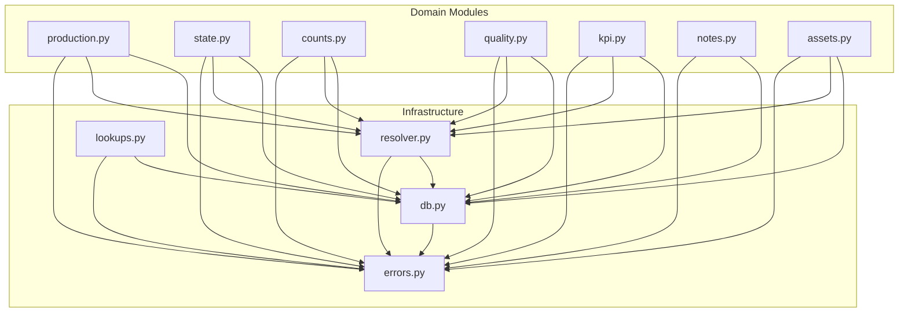

# MES Scripts Reference

This section documents the Python scripting library that provides the domain-driven API for MES operations.

## Module Organization

The library is organized into two layers:

```
mes/
├── __init__.py          # Package initialization & exports
├── Infrastructure Layer ────────────────────────────────────
│   ├── db.py            # Database client (JDBC operations)
│   ├── errors.py        # Exception hierarchy
│   ├── resolver.py      # Entity resolution with caching
│   └── lookups.py       # Reference data caching
│
└── Domain Layer ─────────────────────────────────────────────
    ├── production.py    # Production run management
    ├── state.py         # State transitions & downtime
    ├── counts.py        # Production counting
    ├── quality.py       # Quality measurements
    ├── kpi.py           # KPI operations
    ├── notes.py         # Notes/annotations
    └── assets.py        # Asset hierarchy
```

## Dependency Diagram



## Import Patterns

### Standard Import (Recommended)

```python
# Import specific modules
from mes import production, state, counts, kpi

# Use module functions
run = production.startRun("Line 1", "Widget A")
state.changeState("Line 1", "Running")
```

### Infrastructure Access

```python
# Database operations
from mes import db
result = db.query("SELECT * FROM mes_core.asset_definition")

# Transactions
from mes.db import Transaction
with Transaction() as tx:
    production.startRun("Line 1", "Widget A", transaction=tx)

# Entity resolution
from mes.resolver import resolveAsset, resolveProduct
asset = resolveAsset("Line 1")

# Lookup data
from mes import lookups
states = lookups.getStates()
```

### Error Handling

```python
from mes.errors import (
    MesError,           # Base - catch all MES errors
    MesValidationError, # Invalid parameters
    MesNotFoundError,   # Record not found
    MesDatabaseError,   # SQL/JDBC failures
    MesTransactionError,# Transaction failures
    MesConflictError,   # Business logic conflicts
    MesResolutionError, # Entity resolution failures
)
```

## Module Documentation

### Infrastructure Modules

| Module | Documentation | Purpose |
|--------|---------------|---------|
| `db` | [db-module.md](./infrastructure/db-module.md) | Database connection and query execution |
| `errors` | [errors-module.md](./infrastructure/errors-module.md) | Exception hierarchy |
| `resolver` | [resolver-module.md](./infrastructure/resolver-module.md) | Entity resolution with caching |
| `lookups` | [lookups-module.md](./infrastructure/lookups-module.md) | Reference data access |

### Domain Modules

| Module | Documentation | Purpose |
|--------|---------------|---------|
| `production` | [production-module.md](./domain/production-module.md) | Production run lifecycle |
| `state` | [state-module.md](./domain/state-module.md) | Equipment state management |
| `counts` | [counts-module.md](./domain/counts-module.md) | Production counting |
| `quality` | [quality-module.md](./domain/quality-module.md) | Quality measurements |
| `kpi` | [kpi-module.md](./domain/kpi-module.md) | KPI recording and trending |
| `notes` | [notes-module.md](./domain/notes-module.md) | Annotations for log entries |
| `assets` | [assets-module.md](./domain/assets-module.md) | Asset hierarchy navigation |

## Common Patterns

### Flexible Entity Resolution

All domain functions accept entities in multiple formats:

```python
# By ID (int)
production.startRun(asset=1, product=5)

# By name (str)
production.startRun(asset="Line 1", product="Widget A")

# By tag path (str starting with /)
production.startRun(asset="/Packaging/Line 1", product="Widget A")

# Mixed
production.startRun(asset="/Packaging/Line 1", product=5)
```

### Transaction Support

Group operations for atomic execution:

```python
from mes.db import Transaction
from mes import production, state, counts

with Transaction() as tx:
    run = production.startRun("Line 1", "Widget A", transaction=tx)
    state.changeState("Line 1", "Running", transaction=tx)
    counts.recordGoodCount("Line 1", 0, transaction=tx)
# Auto-commits on success, rolls back on exception
```

### Error Handling Pattern

```python
from mes import production
from mes.errors import MesConflictError, MesResolutionError

try:
    run = production.startRun("Line 1", "Widget A")
except MesConflictError as e:
    # Run already active
    existingRun = production.getActiveRun("Line 1")
    print("Active run:", existingRun['production_log_id'])
except MesResolutionError as e:
    # Asset or product not found
    print("Cannot find:", e.entityType, e.identifier)
```

### Using Lookups for Validation

```python
from mes import lookups

# Get available states for a dropdown
states = lookups.getStates()
stateNames = [s['state_name'] for s in states]

# Validate before use
if userInput not in stateNames:
    raise ValueError("Invalid state: " + userInput)
```

## Version Information

- **Library Version**: 3.0.0
- **Python Runtime**: Jython 2.7 (Ignition)
- **Database**: PostgreSQL 14+ with TimescaleDB

## Related Documentation

- [Architecture Overview](../01-Overview/architecture.md)
- [Quick Start Guide](../01-Overview/quick-start.md)
- [Database Schema](../05-Database/schema-reference.md)
- [Examples](../06-Examples/README.md)
