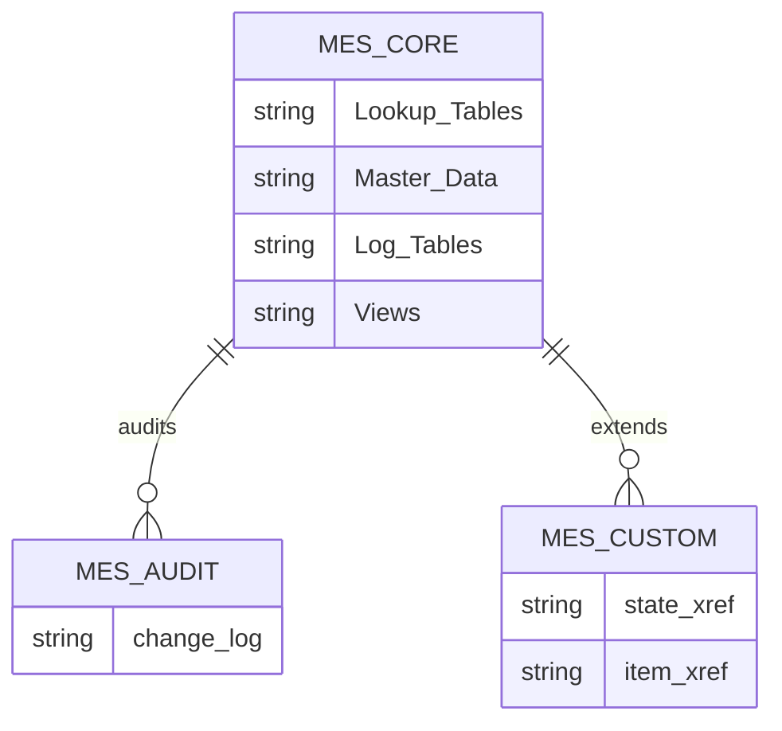
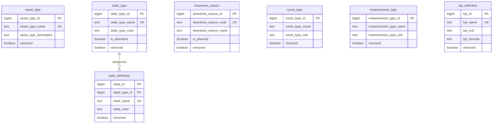
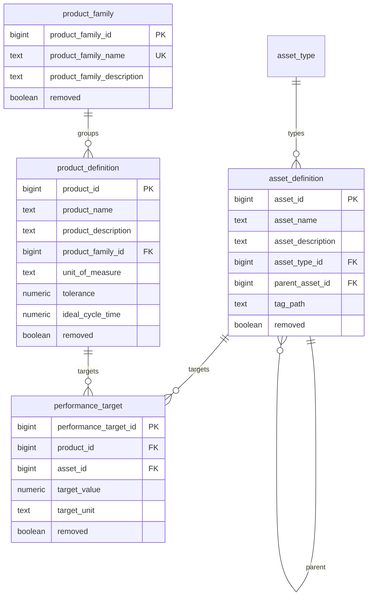
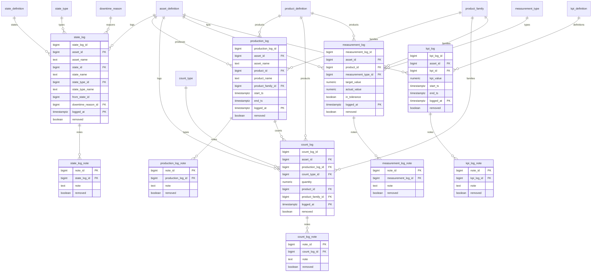
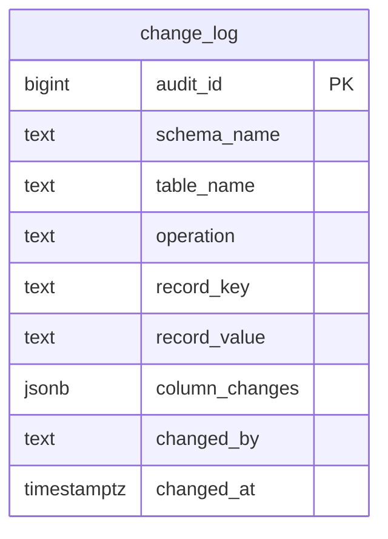
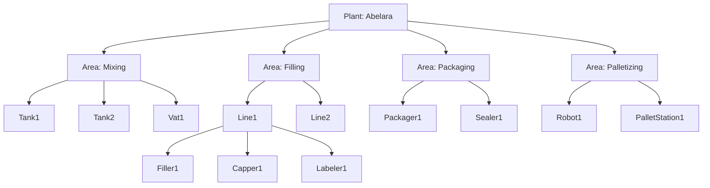
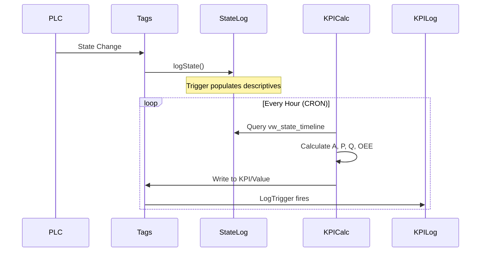
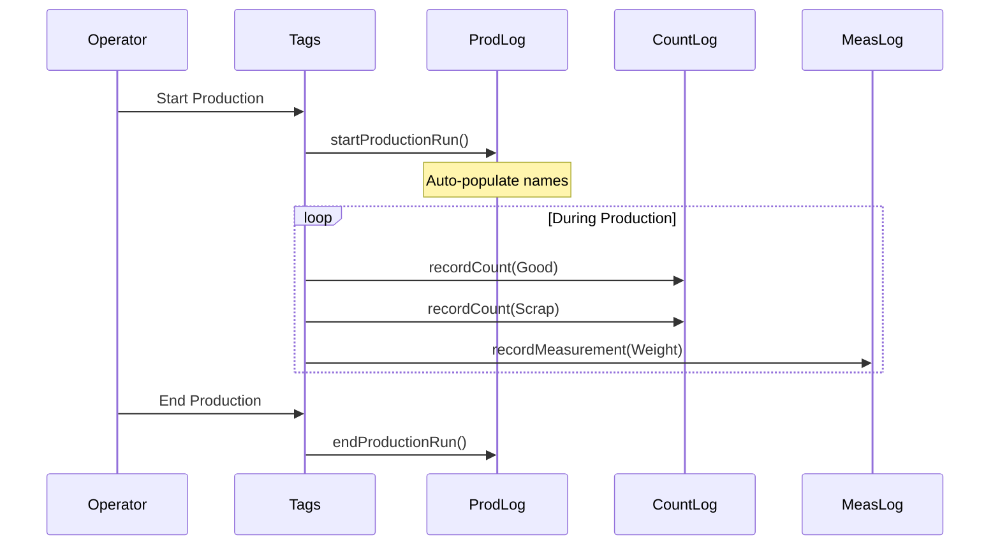

# Entity Relationship Diagrams

This document provides visual entity relationship diagrams for all MES database schemas using Mermaid syntax.

---

## Schema Overview



---

## mes_core: Lookup Tables



---

## mes_core: Master Data Tables



---

## mes_core: Log Tables (Hypertables)



---

## mes_custom: Pilot Integration

```mermaid
erDiagram
    state_definition ||--o{ state_xref : "maps to"
    product_definition ||--o{ item_xref : "maps to"
    item_xref ||--o{ item_extended_attributes : "extends"
    item_xref ||--o{ item_extended_attributes : "parent BOM"

    state_xref {
        int pilot_state_code PK
        varchar pilot_state_name
        varchar pilot_state_type
        bigint mes_state_id FK
        text notes
    }

    item_xref {
        bigint pilot_item_id PK
        varchar pilot_item_name
        bigint mes_product_id FK
    }

    item_extended_attributes {
        bigint pilot_item_id PK_FK
        bigint parent_item_id FK
        varchar item_class
        varchar bottle_size
        varchar label_variant
        int pack_count
    }
```

---

## mes_audit: Change Log



---

## Asset Hierarchy Example



---

## Data Flow: State to KPI



---

## Production Data Flow



---

## Related Documentation

- [Schema Reference](../05-Database/schema-reference.md) - Table details
- [Custom Schema Reference](../05-Database/custom-schema-reference.md) - Pilot integration
- [Views Reference](../05-Database/views-reference.md) - View documentation
- [Architecture Overview](../01-Overview/architecture.md) - System design
